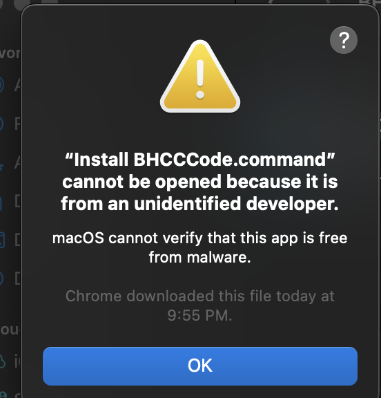
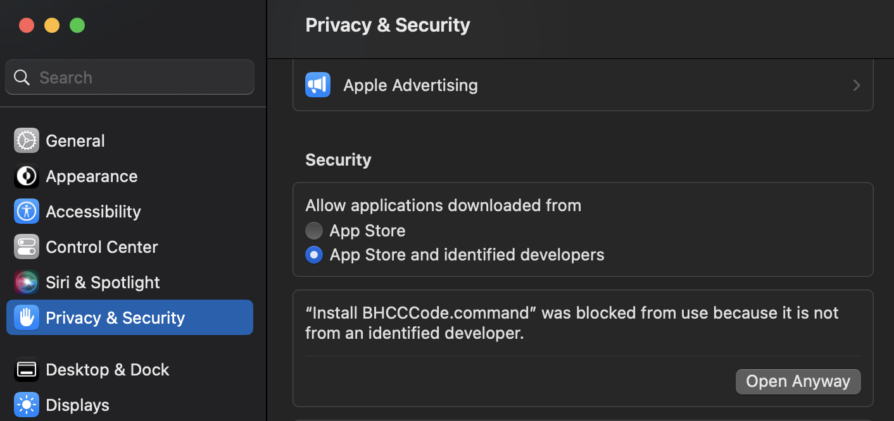

# BHCCCode Installation Guide

## What is BHCCCode?

BHCCCode is a preconfigured Visual Studio Code environment for learning
and writing software. It provides an isolated editor profile, selected language
support, and managed development tools without changing your normal VS Code
settings. You can open existing project folders, and BHCCCode will not
take ownership of or rewrite those projects merely because you open them.

## Installation

Choose the ZIP for your operating system, download it, and extract the entire
archive before running the installer. Setup requires internet access and
installs the editor extensions configured by the release maintainer.

## Windows

1. Download [BHCCCode-Windows.zip](https://github.com/profpradeep/BHCCCode/raw/refs/heads/main/BHCCCode-Windows.zip).
2. Extract all files from the ZIP.
3. Double-click "Install BHCCCode.cmd".
4. Keep the terminal open until setup reports that it finished.

## macOS

1. Download [BHCCCode-macOS.zip](https://github.com/profpradeep/BHCCCode/raw/refs/heads/main/BHCCCode-macOS.zip).
2. Extract all files from the ZIP.
3. Double-click "Install BHCCCode.command".
4. Click OK on the security alert

5. Click on the Apple icon on the top left and select System Settings..
6. Select Privacy & Security on the left, then click on "Open Anyway" next to the "Install BHCCCode.command was blocked ..." message

4. Keep Terminal open until setup reports that it finished.

## Linux

1. Download [BHCCCode-Linux.zip](https://github.com/profpradeep/BHCCCode/raw/refs/heads/main/BHCCCode-Linux.zip).
2. Extract all files from the ZIP.
3. Double-click "Install BHCCCode.desktop".
4. Keep the terminal open until setup reports that it finished. Some desktop
   environments may first ask you to trust or allow launching the file.

## Language support

During interactive installation, select language packs using their numbers or
IDs. Press Enter to accept the default JavaScript/TypeScript support. Use
"all" for every listed language or "none" for no language packs.

## After installation

Open BHCCCode from its desktop shortcut, or run this command in a new
terminal:

    bhcc-code

The downloaded ZIP and extracted installer folder can be deleted after setup
finishes successfully.
